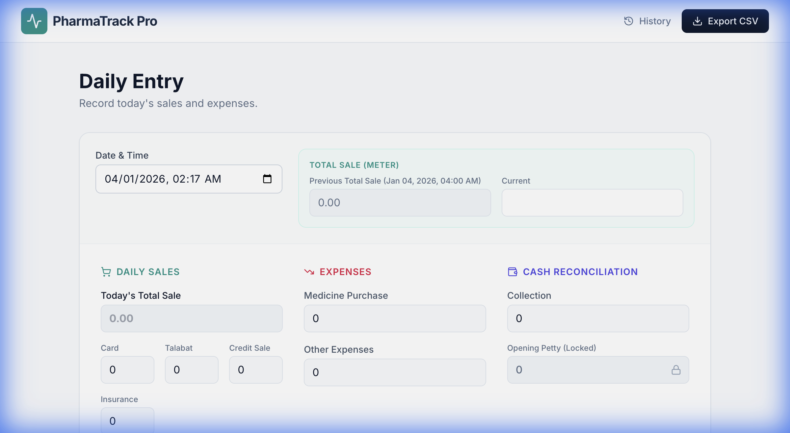
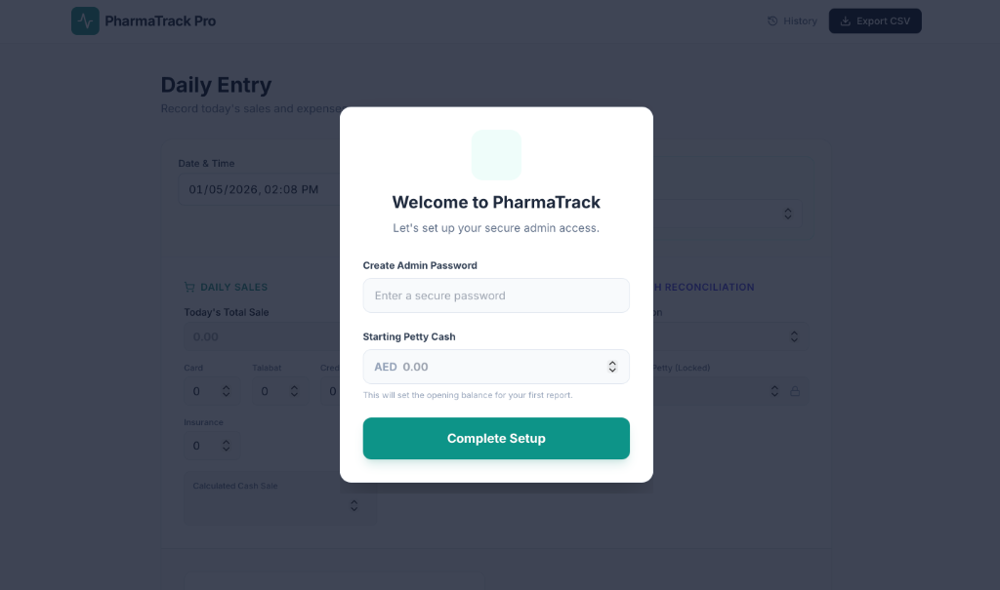

# PharmaTrack Pro 🏥


**PharmaTrack Pro** is a secure, local-first expense and sales tracking application designed specifically for pharmacy management. It streamlines daily financial reporting, automates cash reconciliation, and provides secure data handling with admin-level protection.

## 📸 Interface Preview

| **Main Dashboard** | **Admin Setup** |
|:---:|:---:|
|  |  |
| *Fast, keyboard-friendly data entry* | *Secure initial configuration* |

## ✨ Key Features

* **Daily Financial Dashboard**: Record sales (Cash, Card, Insurance, Talabat, etc.) and expenses in a unified interface.
* **Auto-Reconciliation**: Automatically calculates cash discrepancies based on opening balance, sales, and closing counts.
* **Local Excel Sync**: Automatically logs every new entry to a local Excel file (`pharmacy_expenses.xlsx`) for easy external access.
* **Admin Security**:
    * **Password Protection**: Sensitive actions (Editing reports, Unlocking Petty Cash, Exporting Data) are protected by an admin password.
    * **Secure Setup**: First-time launch wizard to securely set your admin credentials and initial cash float.
* **Interactive History**: View and edit past daily reports with a searchable history modal.
* **Data Export**: Download your full database history as a CSV file for backup and accounting.

## 🛠️ Technology Stack

* **Frontend**: HTML5, Vanilla JavaScript, Tailwind CSS (CDN), Lucide Icons.
* **Backend**: Python, FastAPI, SQLite.
* **Data Storage**: Local SQLite database (`pharmacy_data.db`) + Excel Ledger (`pharmacy_expenses.xlsx`).

## 📦 Installation

Prerequisites:
* Python 3.8+
* Git

1.  **Clone the repository**:
    ```bash
    git clone [https://github.com/naseernachi/pharmatrack.git](https://github.com/naseernachi/pharmatrack.git)
    cd pharmatrack
    ```

2.  **Create a virtual environment** (Recommended):
    ```bash
    python -m venv venv
    # On Windows:
    venv\Scripts\activate
    # On Mac/Linux:
    source venv/bin/activate
    ```

3.  **Install dependencies**:
    ```bash
    pip install -r requirements.txt
    ```

## 🚀 Usage

1.  **Run the application**:
    ```bash
    python src/main.py
    ```
    The app will automatically open in your default browser at `http://127.0.0.1:8000`.

2.  **First-Time Setup**:
    * On the first launch, you will be prompted to set an **Admin Password** and your **Opening Petty Cash**.
    * Remember this password! It is required for all admin functions.

## 📚 Documentation
For a detailed walkthrough of all features, please read the [User Guide](USER_GUIDE.md).

## 📄 License

This project is licensed under the **GNU GPLv3 License** - see the [LICENSE](LICENSE) file for details.

---
### 🤝 Connect
Created by **Naseef AK**.
[LinkedIn](https://www.linkedin.com/in/naseef-ak-24155121b/)
git clone https://github.com/yourusername/pharmacy-tracker.git
    cd pharmacy-tracker
    ```

2.  **Create a virtual environment** (Recommended):
    ```bash
    python -m venv venv
    source venv/bin/activate  # On Windows: venv\Scripts\activate
    ```

3.  **Install dependencies**:
    ```bash
    pip install -r requirements.txt
    ```

## 📚 Documentation
For a detailed walkthrough with screenshots and FAQs, please see the [User Guide](USER_GUIDE.md).

## 🚀 Usage

1.  **Run the application**:
    ```bash
    python src/main.py
    ```
    The app will automatically open in your default browser at `http://127.0.0.1:8000`.

2.  **First-Time Setup**:
    *   On the first launch, you will be prompted to set an **Admin Password** and your **Opening Petty Cash**.
    *   Remember this password! It is required for all admin functions.

3.  **Daily Routine**:
    *   Enter your sales and expenses for the day.
    *   Count your physical cash and enter it in "Actual Cash".
    *   Click **Save Report**.

## 🛡️ Security Note

*   **Local Data**: All data is stored locally on your machine.
*   **Password Recovery**: There is no "Forgot Password" feature for security reasons. If you lose your admin password, you may need to manually access the SQLite database to reset it.

## 📄 License

This project is licensed under the GNU GPLv3 License - see the [LICENSE](LICENSE) file for details.
