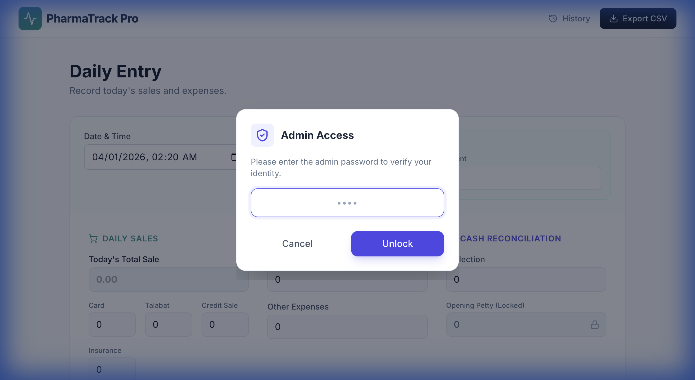

# PharmaTrack Pro: User Guide

Welcome to **PharmaTrack Pro**, your secure and efficient daily expense and sales tracker tailored for pharmacy management. This guide will walk you through the first-time setup and daily operations.

---

## 🚀 First-Time Setup
When you launch the application for the very first time, you will be greeted by the **Welcome Screen**.

**Action Required:**
1.  **Create Admin Password**: Set a secure password. This will be required for sensitive actions like editing past reports or exporting data.
2.  **Starting Petty Cash**: Enter the amount of cash currently in the drawer. This sets your opening balance for the first day.

> [!IMPORTANT]
> Your password is saved securely. If you restart the app, you won't need to do this again.

---

## 📊 Daily Workflow (Main Dashboard)
The main dashboard is designed for speed. Use the **Tab** key to move between fields.

### 1. Sales & Collections
Enter your daily figures in the **Sales** section:
*   **Total Meter Sale**: The total sales reading from your system.
*   **Payment Methods**: Break down the total into **Cash**, **Card**, **Talabat**, **Insurance**, and **Credit**.

### 2. Expenses
Record any payouts in the **Expenses** section:
*   **Medicine Purchases**: Cash used to buy stock.
*   **Other Expenses**: Operational costs (food, transport, etc.).

### 3. Cash Reconciliation
*   **Opening Petty Cash**: This effectively carries over from the previous day's closing.
*   **Current Reading**: Your total daily sales.
*   **Actual Cash**: Count the physical cash and enter it here.
*   **Discrepancy**: The system automatically calculates if you are over or short.

> [!NOTE]
> The **Opening Petty Cash** field is **LOCKED** by default to prevent accidental changes.

---

## 🔒 Admin Security Features
Sensitive operations are protected by your Admin Password.

### Unlocking Petty Cash
If you need to adjust the Opening Petty Cash:
1.  Click the **Lock Icon** 🔒 next to the field.
2.  Enter your **Admin Password** in the popup.
3.  The field will unlock (turn green).
4.  To re-lock it immediately, click the **Unlock Icon** 🔓.

### Editing Past Reports
To Change a previous entry:
1.  Click **History** in the top navigation.
2.  Click the **Pencil Icon** ✏️ next to the report you want to change.
3.  Enter your **Admin Password**.
4.  The form will load with that day's data for you to modify.

---

## 💾 Excel Backup & Ledger Sync

Your data is handled in two ways to ensure safety and flexibility:

### 1. Auto-Sync Ledger (Live Log)
Every time you add a **New Entry**, the app automatically appends it to a local Excel file (`pharmacy_expenses.xlsx`) on your computer.
*   **Purpose**: Acts as a running "Log Book" of daily activity.
*   **Note**: This only records *new* entries. If you edit a report later, the log is not changed (to preserve the original record).

### 2. Full Database Export (Export CSV)
To get a complete, up-to-date copy of your entire history (including all edits and corrections):
1.  Click **Export CSV** in the top right corner.
2.  Enter your **Admin Password**.
3.  The file `transactions.csv` will download.
*   **Purpose**: Use this for your official monthly accounting or secure backups.

> [!TIP]
> Perform a "Full Export" weekly to keep a safe offline copy of your financial data.

---

## ❓ Frequently Asked Questions (FAQ)

### Q: What happens if I close the app or restart my computer?
**A: Your data is 100% safe.**
The app saves every entry instantly to a permanent internal database (`pharmacy_data.db`). Closing the window or shutting down your computer does not affect your saved data. When you open the app again, everything will be exactly where you left it.

### Q: Can I use the app without an internet connection?
**A: Yes.**
PharmaTrack Pro is a local application running on your own machine. It does not require the internet to function.

### Q: I forgot my Admin Password. What do I do?
**A:** Please contact your IT administrator. For security reasons, there is no automatic reset option to prevent unauthorized access.

---

## Technical Support
If you encounter any issues (`Error validating password`, etc.), simply reload the page. The app is designed to be robust and self-healing.
