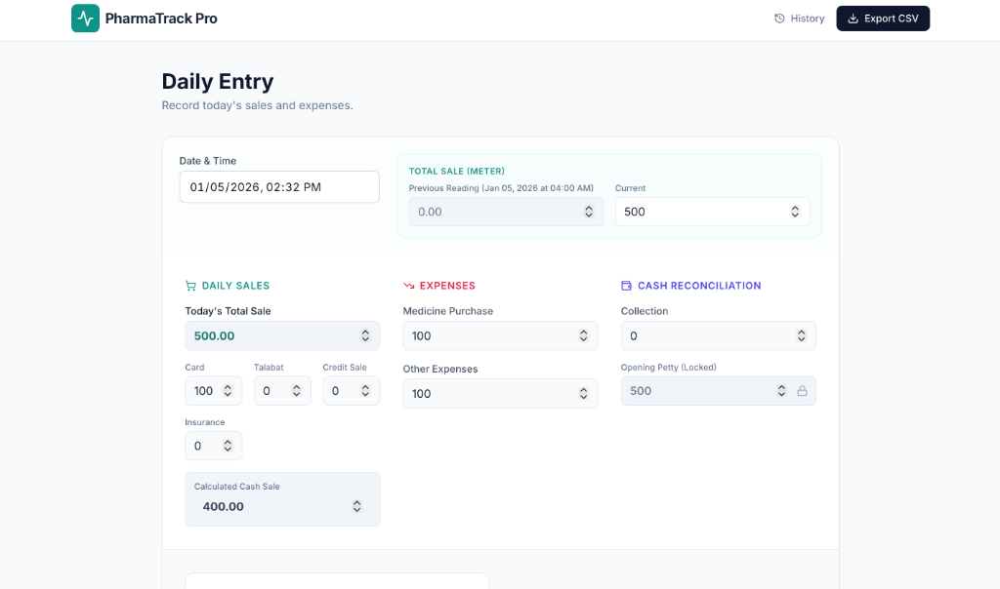
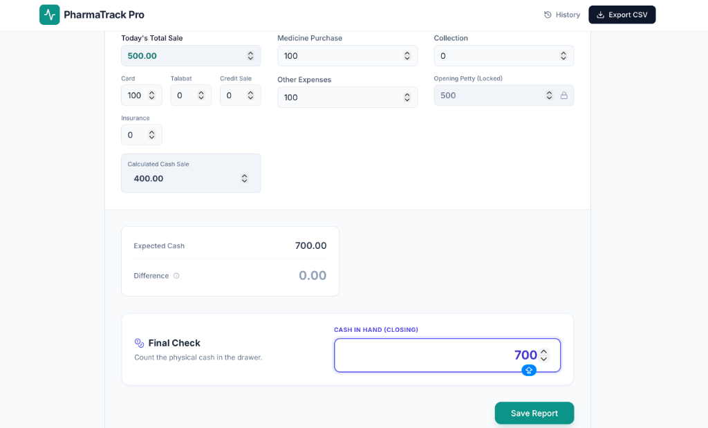
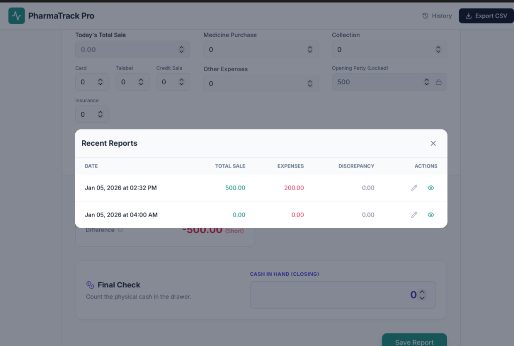

# PharmaTrack Pro: User Guide

Welcome to **PharmaTrack Pro**, your secure and efficient daily expense and sales tracker tailored for pharmacy management. This guide will walk you through the setup and daily operations.

---

## 🚀 1. First-Time Setup
When you launch the application for the first time (or after a reset), you will see the **Setup Wizard**.

### **Step-by-Step:**
1.  **Create Admin Password**: Choosing a secure password is crucial. You will need this password later to **edit reports**, **unlock petty cash**, or **export data**.
2.  **Starting Petty Cash**: Count the literal cash currently in your drawer (e.g., 500 AED) and enter it here. This establishes the baseline for your financial tracking.
3.  Click **Complete Setup**.

---

## 📊 2. The Dashboard Overview
Once setup is complete, you will be taken to the main Daily Entry dashboard. This is where you will record all activity for the day.

The dashboard is divided into three key sections:
1.  **Meter & Readings**: Tracks the total sales from your POS system.
2.  **Sales Breakdown**: Splits the total into Cash, Card, and other payments.
3.  **Cash Reconciliation**: The most important part—verifying the physical cash in the drawer.

---

## 📝 3. Daily Entry Workflow

### A. Entering Sales & Readings
1.  **Current Reading**: Enter the "Total Sale" figure from your POS machine or software.
    *   The system automatically calculates the *Calculated Cash Sale* based on this.
2.  **Payment Breakdown**: Enter amounts for **Card**, **Talabat**, **Insurance**, and **Credit Sales**.
    *   The system subtracts these from the Total Sale to determine how much *should* be in cash.

### B. Recording Expenses
Enter any money taken *out* of the drawer:
*   **Medicine Purchase**: Cash used to buy inventory.
*   **Other Expenses**: Daily operational costs (food, supplies).
*   **Collection**: Money removed by the owner/manager for deposit.

### C. Cash Reconciliation (The Final Check)
This section tells you if your cash matches your records.

1.  **Opening Petty (Locked)**: This is automatically filled from yesterday's closing balance.
2.  **Expected Cash**: The system calculates: `Opening + Cash Sales - Expenses = Expected`.
3.  **Cash In Hand (Final Check)**: Count your physical cash and enter it here.
4.  **Difference**: The system highlights if you are **Short** (Red) or **Excess** (Green).

---

## 🕒 4. History & Editing
To view or correct past reports:
1.  Click the **History** button in the top navigation bar.
2.  A list of recent reports will appear.
3.  Click the **Edit (Pencil)** icon to modify a report (requires Admin Password).
4.  Click the **View (Eye)** icon to see a printable summary.

---

## 💾 5. Exporting Data
To save a backup or send data to your accountant:
1.  Click **Export CSV** in the top right.
2.  Enter your **Admin Password**.
3.  A file named `transactions.csv` will be downloaded to your computer containing all records.

---

## ❓ Troubleshooting
*   **"Opening Petty" is wrong**: Click the **Lock Icon** 🔒 next to the field and enter your admin password to manually correct it.
*   **Forgot Password**: Contact your system administrator to reset the database (Note: This clears all data).
